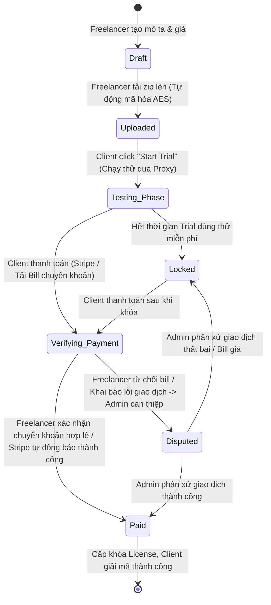

# TỔNG QUAN DỰ ÁN SAFECODE (CRYPTOSYNC)
## Giao Thức Bàn Giao Mã Nguồn An Toàn Cho Freelancer (Secure Source Code Delivery Protocol)

Tài liệu này cung cấp cái nhìn toàn diện về cấu trúc, công nghệ, chức năng và cơ chế hoạt động của dự án **SafeCode (Cryptosync)**. Đây là tài liệu thiết kế để bất kỳ AI nào đọc vào cũng có thể hiểu ngay lập tức và tiếp quản việc phát triển hoặc sửa lỗi.

---

## 1. Giới thiệu chung & Bài toán giải quyết
**SafeCode** là một nền tảng trung gian giúp giải quyết vấn đề lòng tin giữa **Freelancer (Người viết mã nguồn)** và **Client (Khách hàng)** trong các giao dịch bàn giao sản phẩm phần mềm.
- **Vấn đề:** Freelancer sợ bàn giao code xong sẽ bị quỵt tiền; Client sợ thanh toán xong Freelancer không bàn giao code hoặc code bị lỗi, không chạy được.
- **Giải pháp của SafeCode:**
  1. Freelancer tải lên mã nguồn (dạng ZIP), hệ thống tự động mã hóa tệp này bằng thuật toán mã hóa mạnh **AES-256-GCM** trước khi lưu vào AWS S3.
  2. Client có thể chạy thử nghiệm mã nguồn thông qua một môi trường **Proxy Sandbox** được kiểm soát thời gian dùng thử (Trial Minutes) và số dư tín dụng (Credits) để đảm bảo code hoạt động tốt mà không thể đánh cắp mã nguồn.
  3. Client thanh toán số tiền của sản phẩm (qua cổng Stripe hoặc chuyển khoản tải Bill). Tiền được giữ ở dạng **Ký quỹ (Escrow)**.
  4. Freelancer xác nhận nhận tiền, hệ thống sẽ tự động cấp một **khóa giải mã (License Key)** cho Client qua Email và Giao diện Web.
  5. Client sử dụng khóa này để giải mã tệp tin ZIP đã tải xuống thành mã nguồn ban đầu.

---

## 2. Kiến trúc & Công nghệ (Tech Stack)
Dự án được xây dựng theo mô hình **Client-Server** truyền thống với cấu trúc 2 thư mục chính: `/FE` (Frontend) và `/BE` (Backend).

### 2.1. Frontend (`/FE`)
- **Framework:** React 19.2.4 (sử dụng Vite làm công cụ build).
- **Routing:** React Router Dom v7.
- **Styling:** Custom CSS (Vanilla CSS & CSS Modules) tạo giao diện tối màu (Dark Glassmorphic style), kết hợp icons từ `lucide-react`.
- **API Client:** Axios để giao tiếp với Backend, tích hợp interceptor tự động đính kèm JWT token từ `localStorage`.
- **Thông báo:** `react-toastify` để hiển thị các toast notification.

### 2.2. Backend (`/BE`)
- **Runtime & Framework:** Node.js với Express.js (Module ES6).
- **Database:** MongoDB, quản lý thông qua Mongoose (ODM).
- **Lưu trữ:** AWS S3 (dùng `@aws-sdk/client-s3`) để lưu trữ các file nén đã mã hóa (`.zip.enc`) và các bản build chạy thử.
- **Thanh toán:** Cổng thanh toán **Stripe** (`stripe`) cho thanh toán tự động, kết hợp đối soát qua Webhook.
- **Mã hóa:** Thư viện `crypto` tích hợp sẵn của Node.js thực hiện mã hóa luồng tệp tin (Streaming Encryption) bằng AES-256-GCM.
- **Bảo mật:**
  - `helmet` để thiết lập HTTP headers bảo mật.
  - `express-rate-limit` để giới hạn tần suất request chống DDoS.
  - Cơ chế phòng chống tấn công **SSRF (Server-Side Request Forgery)** trong tính năng Proxy Demo, chặn các IP nội bộ/riêng tư.
- **Gửi Email:** `nodemailer` để gửi License Key và thông báo.
- **Tài liệu API:** Swagger UI (`swagger-ui-express`, `swagger-jsdoc`).

---

## 3. Phân quyền người dùng (User Roles)
Hệ thống gồm 3 vai trò người dùng được cá nhân hóa về giao diện và màu sắc:
1. **Freelancer (Người bán):** 
   - Màu giao diện chủ đạo: **Indigo / Violet**.
   - Chức năng: Đăng ký bán code, cấu hình demo (URL/Build), cấu hình trial, tải lên zip mã nguồn (hệ thống tự động mã hóa), xem danh sách file bán, quản lý bill thanh toán thủ công từ khách hàng (Confirm/Dispute), nhận credits sau khi giao dịch thành công.
2. **Client (Người mua):** 
   - Màu giao diện chủ đạo: **Emerald / Teal**.
   - Chức năng: Xem các sản phẩm được giao cho mình, bắt đầu Trial, chạy thử Demo qua Proxy an toàn, nạp credits, thanh toán hóa đơn (Stripe / tải ảnh chuyển khoản thủ công), nhận License Key để giải mã code, thực hiện giải mã trực tiếp trên Web hoặc tải file giải mã.
3. **Admin (Quản trị viên):** 
   - Màu giao diện chủ đạo: **Slate / Red**.
   - Chức năng: Xem tổng quan dashboard hệ thống (doanh thu, số lượng file, người dùng), phê duyệt yêu cầu nạp credits thủ công của người dùng, phân xử tranh chấp (Dispute) khi Freelancer báo chưa nhận được tiền nhưng Client báo đã chuyển khoản.

---

## 4. Các cơ chế nghiệp vụ & kỹ thuật cốt lõi

### 4.1. Mã hóa luồng dữ liệu phong bì (Envelope Encryption & Streaming AES-256-GCM)
Khi Freelancer upload file ZIP chứa mã nguồn:
1. Backend khởi tạo một **Data Key (AES-256 Key)** ngẫu nhiên và một **Initialization Vector (IV)** 12-byte.
2. File ZIP được pipe trực tiếp qua luồng mã hóa: `fileStream` -> `ByteCounter` -> `CipherStream (AES-256-GCM)` -> `PassThrough` -> tải thẳng lên S3 (không lưu file tạm chưa mã hóa ở server).
3. Sau khi mã hóa xong, CipherStream trả về **Auth Tag (Mã xác thực toàn vẹn)**.
4. **Data Key** được mã hóa (wrap) bằng **Master Key** của server (lưu trong biến môi trường `MASTER_KEY_B64`) tạo thành `wrappedKey`.
5. Thông tin lưu vào Database MongoDB (Model `File`): `ivB64`, `authTagB64` và `keyWrapped` (gồm `wrappedKeyB64`, `wrapIvB64`, `wrapAuthTagB64`). Khóa thô (raw key) không bao giờ được lưu trực tiếp vào cơ sở dữ liệu.

### 4.2. Trình duyệt chạy thử an toàn qua Proxy (Secure Demo Proxy)
Để Client xem thử kết quả chạy code (ví dụ: một ứng dụng web đang chạy) mà không thể truy cập trực tiếp vào host gốc hay biết IP/URL thật:
1. Freelancer cung cấp link demo của dự án (ví dụ link chạy trên server riêng của Freelancer).
2. Khi Client xem thử (Preview), Client sẽ gửi request tới endpoint của SafeCode: `/api/preview/:fileId`.
3. Backend kiểm tra phiên sử dụng (PreviewSession):
   - Kiểm tra xem Client có đang trong thời gian Trial miễn phí hay không.
   - Nếu hết Trial, kiểm tra xem Client có đủ credits tối thiểu (0.1 CR) để tiếp tục duy trì phiên chạy thử hay không.
4. Backend sử dụng `http-proxy-middleware` làm nhiệm vụ chuyển tiếp (Proxy) toàn bộ request từ trình duyệt Client tới URL demo gốc.
5. Trước khi gửi upstream, backend loại bỏ toàn bộ Authorization Headers và Cookies nhạy cảm của Client.
6. Cơ chế chống SSRF thực hiện phân giải DNS của hostname demo. Nếu hostname phân giải ra IP nội bộ (ví dụ `127.0.0.1`, `10.x.x.x`, `192.168.x.x`...), request sẽ bị chặn ngay lập tức.
7. Có một worker chạy ngầm (`cleanup.worker.js`) tự động dọn dẹp các session preview hết hạn.

### 4.3. Quản lý Quyền số DRM (Digital Rights Management) & Xác thực Thiết bị (V3 DRM)
Khi Client đã thanh toán thành công và yêu cầu lấy khóa giải mã:
1. Hệ thống cấp một License Key (Serial Key) duy nhất ứng với file và khách hàng đó.
2. Khi Client gửi request giải mã kèm `licenseKey` và `deviceId` lên server:
   - Server kiểm tra License Key có khớp với file và client đang đăng nhập hay không.
   - Kiểm tra `deviceId` gửi lên để giới hạn số lượng thiết bị được giải mã (tránh chia sẻ khóa trái phép).
   - Nếu hợp lệ, server sẽ lấy `keyWrapped` từ database, giải mã (unwrap) nó bằng Master Key của server để thu được khóa giải mã gốc (raw Data Key), sau đó trả về cho trình duyệt Client.
3. Ở client, việc giải mã tệp ZIP được thực hiện bằng cách upload tệp `.zip.enc` đã tải về kèm theo thông tin khóa (`keyB64`, `ivB64`, `authTagB64`) thông qua endpoint `/api/files/decrypt-local` để giải mã luồng và tải về tệp `.zip` gốc.

---

## 5. Cấu trúc thư mục chi tiết

### 5.1. Thư mục Frontend (`/FE`)
```text
FE/
├── public/                 # Các tài nguyên tĩnh công cộng
├── src/
│   ├── assets/             # Hình ảnh, logo, CSS tĩnh
│   ├── components/         # Các thành phần tái sử dụng
│   │   ├── chat/
│   │   │   ├── ChatBox.jsx # Khung chat trao đổi giữa Freelancer và Client
│   │   │   └── ChatBox.css
│   │   ├── layout/
│   │   │   ├── Header.jsx  # Thanh header chứa thông tin số dư credits, thông báo, logout
│   │   │   ├── Layout.jsx  # Layout chung bao gồm Sidebar và Header
│   │   │   └── Sidebar.jsx # Thanh điều hướng tùy biến theo Role người dùng
│   │   └── ui/             # Các thành phần giao diện nhỏ (Atomic UI Components)
│   │       ├── Badge.jsx   # Nhãn trạng thái (Draft, Uploaded, Testing, Paid, Disputed)
│   │       ├── Button.jsx  # Nút bấm dùng chung
│   │       ├── Card.jsx    # Thẻ hiển thị thông tin
│   │       └── Table.jsx   # Bảng dữ liệu hỗ trợ phân trang, lọc
│   ├── contexts/
│   │   └── AuthContext.jsx # Quản lý trạng thái đăng nhập, phân vai trò, xử lý Login/Signup
│   ├── pages/              # Các trang giao diện chính
│   │   ├── auth/
│   │   │   ├── Login.jsx   # Trang đăng nhập và đăng ký (tích hợp chọn Role)
│   │   │   └── Login.css
│   │   ├── dashboards/
│   │   │   ├── AdminDashboard.jsx      # Thống kê, duyệt nạp tiền, xử lý tranh chấp
│   │   │   ├── ClientDashboard.jsx     # Dashboard cho khách hàng (xem file được giao, mua, preview)
│   │   │   ├── FreelancerDashboard.jsx # Dashboard cho Freelancer (quản lý file bán, theo dõi bill)
│   │   │   └── Dashboard.css
│   │   ├── features/
│   │   │   ├── Credits.jsx     # Quản lý nạp tiền, xem lịch sử giao dịch và yêu cầu nạp
│   │   │   ├── DisputeRoom.jsx # Phòng giải quyết tranh chấp, hỗ trợ chat với admin
│   │   │   ├── Files.jsx       # Quản lý download file mã hóa và thực hiện giải mã (Decrypt ZIP)
│   │   │   ├── Settings.jsx    # Cấu hình tài khoản, thông tin thanh toán ngân hàng/Stripe
│   │   │   └── Upload.jsx      # Form tải lên file nguồn, cấu hình demo và trial
│   │   └── landing/
│   │       ├── Landing.jsx # Trang chủ giới thiệu nền tảng (sử dụng hiệu ứng Glassmorphism)
│   │       └── Landing.css
│   ├── services/
│   │   └── api.js          # Khởi tạo Axios client, đính kèm JWT Token vào Header.Authorization
│   ├── App.jsx             # File cấu hình Routing chính, quản lý tải danh sách file và đồng bộ role
│   ├── index.css           # CSS hệ thống chung (font Geist & JetBrains Mono, định nghĩa biến màu cho 3 role)
│   └── main.jsx            # Điểm khởi đầu ứng dụng React
├── index.html              # HTML template
├── vite.config.js          # Cấu hình Vite
└── package.json            # Các thư viện phụ thuộc Frontend
```

### 5.2. Thư mục Backend (`/BE`)
```text
BE/
├── src/
│   ├── config/
│   │   ├── db.js           # Kết nối cơ sở dữ liệu MongoDB
│   │   └── env.js          # Xác thực và quản lý các biến môi trường (.env)
│   ├── controllers/        # Xử lý logic nghiệp vụ cho từng nhóm chức năng
│   │   ├── admin.controller.js
│   │   ├── auth.controller.js
│   │   ├── billing.controller.js
│   │   ├── files.controller.js
│   │   ├── messages.controller.js
│   │   ├── notifications.controller.js
│   │   ├── payments.controller.js
│   │   ├── preview.controller.js
│   │   ├── reviews.controller.js
│   │   └── webhooks.controller.js
│   ├── middleware/         # Middleware lọc request
│   │   ├── auth.js         # Xác thực JWT token, lấy thông tin user đính kèm vào req.user
│   │   └── error.js        # Xử lý lỗi tập trung, định nghĩa httpError
│   ├── models/             # Định nghĩa cấu trúc các bảng MongoDB (Schemas)
│   │   ├── CreditHistory.js
│   │   ├── CreditRequest.js
│   │   ├── File.js
│   │   ├── LicenseKey.js
│   │   ├── Message.js
│   │   ├── Notification.js
│   │   ├── PreviewSession.js
│   │   ├── Review.js
│   │   ├── Transaction.js
│   │   └── User.js
│   ├── routes/             # Định nghĩa đường dẫn API endpoints
│   │   ├── admin.routes.js
│   │   ├── auth.routes.js
│   │   ├── billing.routes.js
│   │   ├── credit.routes.js
│   │   ├── files.routes.js
│   │   ├── index.js        # Router tổng điều hướng các API prefixes
│   │   ├── messages.routes.js
│   │   ├── notifications.routes.js
│   │   ├── payments.routes.js
│   │   ├── preview.routes.js
│   │   ├── proxy.routes.js
│   │   ├── reviews.routes.js
│   │   └── webhooks.routes.js
│   ├── services/           # Các dịch vụ độc lập
│   │   ├── credit.service.js   # Logic khấu trừ/cộng dồn credits của user
│   │   ├── crypto.service.js   # Mã hóa, giải mã AES-256-GCM, wrap/unwrap Data Key
│   │   ├── email.service.js    # Cấu hình nodemailer gửi email bàn giao khóa giải mã
│   │   ├── license.service.js  # Tạo và xác thực License Key chống vi phạm bản quyền
│   │   ├── proxy.service.js    # Khởi tạo proxy middleware kiểm tra tín dụng và chống SSRF
│   │   ├── s3.service.js       # Tải lên/tải xuống S3, tạo presigned URL cho S3
│   │   └── stripe.service.js   # Cấu hình thanh toán Stripe
│   ├── utils/
│   │   └── validateUrl.js  # Kiểm tra độ an toàn của URL demo trước khi proxy
│   ├── workers/
│   │   └── cleanup.worker.js # Xóa bỏ các session preview đã hết hạn
│   ├── app.js              # Cấu hình Express app (CORS, Helmet, Rate Limit, JSON Parser)
│   └── server.js           # Khởi chạy ứng dụng và lắng nghe PORT
├── create-admin.js         # Script tạo tài khoản Admin hệ thống nhanh
├── seed.js                 # Script seed dữ liệu giả lập ban đầu để test
└── package.json            # Các thư viện phụ thuộc Backend
```

---

## 6. Sơ đồ các luồng API chính

### 6.0. Tài liệu và Thử nghiệm API trực quan (Swagger UI)
* `GET /api-docs` - Trang giao diện Swagger UI trực quan, cho phép nhà phát triển đọc tài liệu chi tiết và chạy thử (test) trực tiếp các endpoint của backend ngay trên trình duyệt (hỗ trợ cả Local và môi trường Production đã deploy).

### 6.1. Xác thực (`/api/auth`)
* `POST /auth/register` - Đăng ký tài khoản (hỗ trợ các vai trò freelancer, client, admin).
* `POST /auth/login` - Đăng nhập nhận JWT Token.
* `GET /auth/me` - Lấy thông tin tài khoản hiện tại.

### 6.2. Quản lý File & Mã hóa (`/api/files`)
* `POST /files` - Freelancer tạo bản nháp file bàn giao (gồm cấu hình giá, demo, trial).
* `POST /files/upload/:fileId` - Freelancer tải lên tệp zip và build demo (Hệ thống tự động thực hiện mã hóa AES và đẩy lên S3).
* `GET /files/mine` - Freelancer lấy danh sách file do mình bán.
* `GET /files/assigned` - Client lấy danh sách file giao cho mình mua.
* `POST /files/trial/:fileId` - Client bắt đầu tính giờ dùng thử.
* `GET /files/download-encrypted/:fileId` - Client tải về tệp tin ZIP đã được mã hóa (`.zip.enc`).
* `POST /files/decrypt-key/:fileId` - Gửi License Key để nhận khóa giải mã AES gốc (đối chiếu DRM & Device ID).
* `POST /files/decrypt-local` - Client gửi file `.zip.enc` kèm thông tin key để nhận file giải mã `.zip` gốc (không tải file lên server để decrypt, xử lý bằng stream).

### 6.3. Demo chạy thử an toàn (`/api/preview` & `/api/proxy`)
* `POST /preview/start/:fileId` - Khởi tạo một phiên (session) xem thử.
* `POST /preview/heartbeat/:sessionId` - Gửi heartbeat để duy trì session preview (kiểm tra credits nếu hết trial).
* `GET /proxy/:fileId/*` - Đường dẫn proxy trung gian chuyển tiếp request sang URL chạy demo thật của Freelancer (kiểm soát trial/credits và bảo vệ SSRF).

### 6.4. Thanh toán & Tranh chấp
* `/api/payments/checkout/:fileId` - Khởi tạo phiên thanh toán tự động qua Stripe.
* `/api/files/receipt/:fileId` - Client tải lên hình ảnh biên lai chuyển khoản ngân hàng thủ công.
* `/api/files/confirm-payment/:fileId` - Freelancer phê duyệt biên lai thủ công (Xác nhận -> Trạng thái Paid, Cấp License; Từ chối -> Mở Tranh chấp).
* `/api/admin/credit-requests` - Admin xem và phê duyệt các yêu cầu nạp tiền thủ công.

---

## 7. Các trạng thái của một File bàn giao (File Lifecycle States)
Một tệp bàn giao mã nguồn sẽ đi qua các trạng thái tuần tự:


---

## 8. Cấu hình chạy dự án dưới Local

### 8.1. Cấu hình Backend (`/BE/.env`)
Cần tạo file `.env` với các nội dung sau:
```env
PORT=4000
MONGO_URI=mongodb://localhost:27017/safecode
JWT_SECRET=your_jwt_secret_key
CORS_ORIGIN=http://localhost:5173
NODE_ENV=development

# AWS S3 Config (Dùng để chứa các file mã hóa)
AWS_REGION=ap-southeast-1
S3_BUCKET_ENCRYPTED=safecode-encrypted-bucket
S3_BUCKET_BUILDS=safecode-builds-bucket
AWS_ACCESS_KEY_ID=mock_key
AWS_SECRET_ACCESS_KEY=mock_secret

# Master Key mã hóa Data Key (Yêu cầu chính xác 32-byte Base64)
MASTER_KEY_B64=zW4G3n9L5rY7pQ2tK8sW1vX5zA9cE3gT7yU1iO4pA2s=

# Stripe (Cổng thanh toán tự động)
STRIPE_SECRET_KEY=sk_test_...
STRIPE_WEBHOOK_SECRET=whsec_...

# Email gửi License Key
SMTP_HOST=smtp.gmail.com
SMTP_PORT=587
SMTP_USER=your_email@gmail.com
SMTP_PASS=your_app_password
```

### 8.2. Cấu hình Frontend (`/FE/.env.production` hoặc `.env`)
```env
VITE_API_URL=http://localhost:4000
```

### 8.3. Lệnh khởi chạy nhanh
- **Backend:** `cd BE && npm install && npm run dev` (Khởi chạy server Node.js với hot-reload qua `--watch`).
- **Frontend:** `cd FE && npm install && npm run dev` (Khởi chạy Vite dev server chạy ở cổng `5173`).
